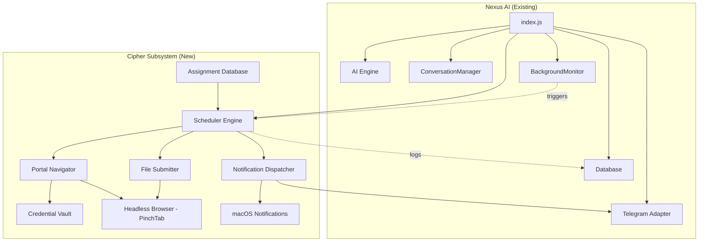
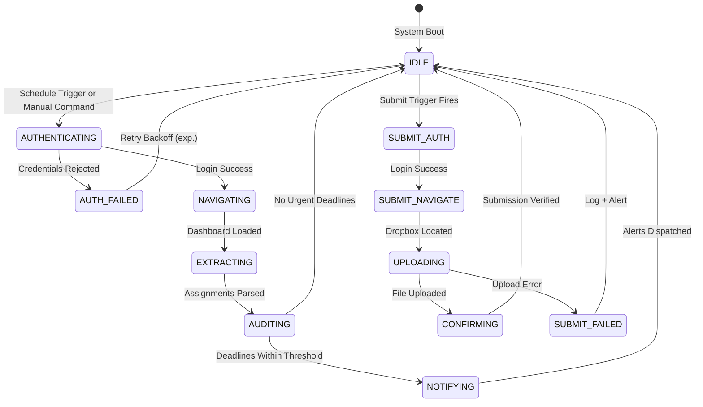

# Cipher — Autonomous Academic Automation Agent

Integrated as a first-class subsystem within the **Nexus AI** stack, Cipher provides autonomous portal navigation, assignment tracking, deadline alerting, and scheduled file submission for university LMS platforms (with a reference implementation against Wright State's D2L Brightspace / PingFederate SSO).

---

## Implementation Status

This document was originally written as a design proposal. Every component described below has since been implemented and is live in the current codebase. The originally open architectural questions have been resolved as follows:

| Original Question | Resolution |
|---|---|
| University portal URL & login flow | Configurable per-deployment via `config/cipher-portal.json`. Reference implementation: Wright State Pilot (D2L) with PingFederate SSO redirect to `auth.wright.edu` and Duo 2FA. |
| Portal authentication method | Full SSO handling in `portal-navigator.js` — detects auto-redirect, falls back to clicking a LOGIN link, waits up to 60 s for Duo 2FA approval, auto-clicks *"Yes, this is my device"*, and retries with exponential backoff on failure. |
| Credential security | Implemented as proposed — AES-256-GCM with `scrypt` key derivation, unique salt + IV per encryption, stored at `data/cipher-vault.enc`. Master key in `.env` as `CIPHER_VAULT_KEY` (generated via `node src/cipher-cli.js generate-key`). OS-keychain integration was not pursued — the current model is sufficient for single-user local deployments. |
| Notification channels | Three channels live: Telegram (via the existing bot instance injected by `src/index.js`), macOS Notification Center (via `osascript`), and optional Twilio SMS for HIGH / CRITICAL urgencies. Chat ID configured via `CIPHER_TELEGRAM_CHAT_ID`. |
| Assignment file paths | Declared in `config/cipher-submissions.json` as `{ coursePattern, assignmentPattern, filePath, submitAt }` entries. `cipher-submitter.matchAndQueue()` matches scanned assignments against this manifest and auto-queues submissions. |

Cipher also now integrates with the Nexus AI autonomous tooling layer:

- The `cipher_scan_portal`, `cipher_list_assignments`, and `cipher_schedule_submission` tools are available on every supported provider — OpenAI, **Anthropic Claude**, Google Gemini, and NVIDIA NIM — through the provider-agnostic tool schema translator in `ai-engine.js`.
- Cipher state (due dates, scores, submission status) can be surfaced via **long-term memory** (`save_core_memory`) when the user asks the AI to remember preferences such as *"always submit my CS 4100 homework two hours before the deadline"*.
- All scheduler activity is recorded in the `cipher_audit_log` table; God Mode's `read_source_file` tool can read the audit records for post-hoc debugging without any special privilege.

---

## Architecture Overview



### State Machine — Cipher Lifecycle



---

## Proposed Changes

### Credential Vault

New encrypted vault for portal credentials — never stored in plaintext.

#### [NEW] [cipher-vault.js](file:///Users/khellonpatel/Desktop/tem/nexus-ai/src/core/cipher-vault.js)

- `CipherVault` class using Node.js built-in `crypto` module (AES-256-GCM)
- Methods: `encrypt(data)`, `decrypt(data)`, `storeCredentials(username, password)`, `getCredentials()`
- Vault file stored at `data/cipher-vault.enc`
- Master encryption key sourced from `CIPHER_VAULT_KEY` env var
- CLI helper to initially set credentials: `node src/cipher-cli.js set-credentials`

---

### Portal Navigator

Headless browser automation using the existing PinchTab integration.

#### [NEW] [portal-navigator.js](file:///Users/khellonpatel/Desktop/tem/nexus-ai/src/core/portal-navigator.js)

- `PortalNavigator` class extending the existing `ToolExecutor` browser methods
- **State machine** with states: `IDLE`, `AUTHENTICATING`, `NAVIGATING`, `EXTRACTING`, `AUTH_FAILED`
- `login()` — Navigate to portal URL, inject credentials from vault, handle redirects
- `navigateToDashboard()` — Post-login navigation to assignment hub
- `extractAssignments()` — Parse dropbox list, extract: `{ title, courseId, dueDate, description, dropboxUrl, status }`
- `navigateToDropbox(dropboxUrl)` — Navigate to specific assignment dropbox for submission
- Configurable selectors via `config/cipher-portal.json` so UI changes don't require code edits
- Retry logic with exponential backoff (3 attempts, 2s → 4s → 8s)
- Screenshot capture on failure for debugging (saved to `data/cipher-screenshots/`)

---

### Assignment Database

New SQLite tables in existing `nexus.db`.

#### [MODIFY] [database.js](file:///Users/khellonpatel/Desktop/tem/nexus-ai/src/core/database.js)

Add new tables and methods:

```sql
CREATE TABLE IF NOT EXISTS cipher_assignments (
    id TEXT PRIMARY KEY,
    course_id TEXT NOT NULL,
    course_name TEXT,
    title TEXT NOT NULL,
    description TEXT,
    due_date DATETIME NOT NULL,
    dropbox_url TEXT,
    status TEXT DEFAULT 'pending',  -- pending, submitted, overdue, notified
    last_checked DATETIME DEFAULT CURRENT_TIMESTAMP,
    submitted_at DATETIME,
    submission_file TEXT,
    created_at DATETIME DEFAULT CURRENT_TIMESTAMP
);

CREATE TABLE IF NOT EXISTS cipher_submissions (
    id TEXT PRIMARY KEY,
    assignment_id TEXT NOT NULL,
    file_path TEXT NOT NULL,
    scheduled_at DATETIME NOT NULL,
    executed_at DATETIME,
    status TEXT DEFAULT 'queued',  -- queued, submitted, failed, confirmed
    error_message TEXT,
    FOREIGN KEY (assignment_id) REFERENCES cipher_assignments(id)
);

CREATE TABLE IF NOT EXISTS cipher_audit_log (
    id TEXT PRIMARY KEY,
    event_type TEXT NOT NULL,  -- scan, notify, submit, error
    details TEXT,
    created_at DATETIME DEFAULT CURRENT_TIMESTAMP
);
```

New methods:
- `upsertAssignment(data)` — Insert or update assignment by title + courseId
- `getPendingAssignments()` — Get assignments where `due_date > now` and `status != 'submitted'`
- `getUrgentAssignments(hoursThreshold)` — Assignments due within N hours
- `queueSubmission(assignmentId, filePath, scheduledAt)` — Add to submission queue
- `getPendingSubmissions()` — Get queued submissions where `scheduled_at <= now`
- `logAuditEvent(type, details)` — Write to audit log

---

### Scheduler Engine

Internal cron-like scheduler using `setInterval` + priority queue.

#### [NEW] [cipher-scheduler.js](file:///Users/khellonpatel/Desktop/tem/nexus-ai/src/core/cipher-scheduler.js)

- `CipherScheduler` class
- **Scan Schedule**: Configurable interval (default: every 2 hours) to:
  1. Authenticate → navigate → extract assignments → upsert to DB
  2. Audit deadlines → dispatch notifications for assignments due within threshold
- **Submission Queue**: Checks every 5 minutes for queued submissions where `scheduled_at <= now`
  1. Authenticate → navigate to dropbox → upload file → confirm → update DB
- **Notification Schedule**: 
  - 48-hour warning (single SMS/Telegram)
  - 24-hour warning (SMS + desktop push)
  - 6-hour warning (escalated: all channels)
  - 1-hour warning (critical: repeated alerts)
- Priority queue with `deadline - now` as priority value
- Methods: `start()`, `stop()`, `runScan()`, `runSubmissionQueue()`, `scheduleSubmission(assignmentId, filePath, time)`

---

### Notification Dispatcher

Multi-channel alerting.

#### [NEW] [cipher-notifier.js](file:///Users/khellonpatel/Desktop/tem/nexus-ai/src/core/cipher-notifier.js)

- `CipherNotifier` class
- **Telegram**: Uses existing `node-telegram-bot-api` — sends formatted messages to configured chat ID
- **macOS Desktop**: Uses `child_process.exec` + `osascript` to trigger native Notification Center alerts
- **SMS (optional)**: Twilio integration if credentials provided
- Message formatting:
  ```
  🚨 CIPHER ALERT — Assignment Due Soon
  ━━━━━━━━━━━━━━━━━━━━━━━━━━
  📚 CS 301 — Data Structures
  📝 Homework #5: Binary Trees
  ⏰ Due: Apr 14, 2026 at 11:59 PM
  ⏳ Time Left: 23h 41m
  ━━━━━━━━━━━━━━━━━━━━━━━━━━
  ```
- Deduplication: Won't re-send the same alert within a configurable cooldown window (default: 4 hours)
- Methods: `sendAlert(assignment, urgencyLevel)`, `sendSubmissionConfirmation(assignment)`, `sendDailySummary(assignments)`

---

### File Submitter

Automated file upload via headless browser.

#### [NEW] [cipher-submitter.js](file:///Users/khellonpatel/Desktop/tem/nexus-ai/src/core/cipher-submitter.js)

- `CipherSubmitter` class
- Takes a `PortalNavigator` instance
- `submit(assignmentId, filePath)`:
  1. Verify file exists locally
  2. Authenticate via navigator
  3. Navigate to assignment dropbox URL
  4. Locate file upload input element via PinchTab snapshot
  5. Upload file via PinchTab file upload action
  6. Click submit button
  7. Verify confirmation page/message
  8. Update database status
  9. Send confirmation notification
- File path mapping via `config/cipher-submissions.json`:
  ```json
  {
    "submissions": [
      {
        "coursePattern": "CS 301",
        "assignmentPattern": "Homework #5",
        "filePath": "/Users/khellonpatel/Assignments/CS301/hw5.pdf",
        "submitAt": "2026-04-14T10:00:00-04:00"
      }
    ]
  }
  ```

---

### CLI Tool

Setup and management interface.

#### [NEW] [cipher-cli.js](file:///Users/khellonpatel/Desktop/tem/nexus-ai/src/cipher-cli.js)

- `set-credentials` — Encrypt and store portal username/password
- `scan-now` — Trigger immediate portal scan
- `list-assignments` — Show all tracked assignments with status
- `schedule-submit` — Queue a file for submission
- `view-log` — Show audit trail
- Uses `inquirer` (already a dependency) for interactive prompts

---

### Configuration Files

#### [NEW] [cipher-portal.json](file:///Users/khellonpatel/Desktop/tem/nexus-ai/config/cipher-portal.json)

Portal-specific selectors and URLs — editable without code changes:
```json
{
  "portalUrl": "https://your-university-portal.edu",
  "loginSelectors": {
    "usernameInput": "#username",
    "passwordInput": "#password", 
    "submitButton": "#login-btn"
  },
  "dashboardSelectors": {
    "courseLinks": ".course-card a",
    "assignmentList": ".assignment-row",
    "assignmentTitle": ".assignment-title",
    "dueDate": ".due-date",
    "dropboxLink": ".dropbox-link"
  },
  "submissionSelectors": {
    "fileInput": "input[type='file']",
    "submitButton": ".submit-btn",
    "confirmationText": "Submission successful"
  }
}
```

#### [NEW] [cipher-submissions.json](file:///Users/khellonpatel/Desktop/tem/nexus-ai/config/cipher-submissions.json)

Pre-configured submission mappings (file → dropbox → schedule time).

---

### Integration with Nexus AI

#### [MODIFY] [.env.example](file:///Users/khellonpatel/Desktop/tem/nexus-ai/.env.example)

Add new Cipher-specific environment variables:
```env
# ═══ Cipher — Academic Automation ═══
CIPHER_ENABLED=true
CIPHER_VAULT_KEY=          # 32-char hex key for credential encryption
CIPHER_SCAN_INTERVAL=7200  # Seconds between portal scans (default: 2 hours)
CIPHER_TELEGRAM_CHAT_ID=   # Your personal Telegram chat ID for alerts
CIPHER_ALERT_THRESHOLDS=48,24,6,1  # Hours before due date to alert
CIPHER_MACOS_NOTIFICATIONS=true
# Optional: Twilio SMS
CIPHER_TWILIO_SID=
CIPHER_TWILIO_AUTH=
CIPHER_TWILIO_FROM=
CIPHER_TWILIO_TO=
```

#### [MODIFY] [index.js](file:///Users/khellonpatel/Desktop/tem/nexus-ai/src/index.js)

- Import and initialize `CipherScheduler` after core systems boot
- Connect to existing database, AI engine, and Telegram adapter
- Add to graceful shutdown sequence

#### [MODIFY] [tools.js](file:///Users/khellonpatel/Desktop/tem/nexus-ai/src/core/tools.js)

Add new Cipher tools to the AI tool registry:
- `cipher_scan_portal` — Trigger an immediate portal scan
- `cipher_list_assignments` — Return current assignment tracker state
- `cipher_schedule_submission` — Queue a file for submission
- These allow Nexus AI's conversational interface to control Cipher via natural language

---

## Error Handling Protocol

| Scenario | Response |
|---|---|
| **Network Timeout** | Retry 3x with exponential backoff (2s, 4s, 8s). Log to audit. Alert if all retries fail. |
| **Authentication Rejection** | Abort immediately. Send Telegram alert: "🔒 Portal login failed — credential rotation may be needed." Don't retry credentials to avoid account lockout. |
| **Altered Portal UI** | If expected selectors not found, capture full-page screenshot. Send alert with error details. Fall back to AI-assisted parsing (send snapshot to AI engine for adaptive element discovery). |
| **File Not Found** | For submissions: abort, log, alert. Don't submit anything. |
| **Upload Failure** | Retry 2x. If still failing, send critical alert with deadline countdown. |
| **Duplicate Submission** | Check database for existing successful submission before uploading. Skip if already submitted. |
| **Scheduler Crash** | Caught by existing `uncaughtException` handler. Auto-restart scheduler after 30s delay. |

---

## New Files Summary

| File | Purpose |
|---|---|
| `src/core/cipher-vault.js` | AES-256-GCM credential encryption/decryption |
| `src/core/portal-navigator.js` | Headless browser automation for portal interaction |
| `src/core/cipher-scheduler.js` | Internal cron engine for scans and submissions |
| `src/core/cipher-notifier.js` | Multi-channel notification dispatcher |
| `src/core/cipher-submitter.js` | Automated file upload to portal dropboxes |
| `src/cipher-cli.js` | CLI for credential setup and manual operations |
| `config/cipher-portal.json` | Portal selectors and URLs (editable config) |
| `config/cipher-submissions.json` | File-to-dropbox submission mappings |

## Modified Files Summary

| File | Change |
|---|---|
| `src/core/database.js` | Add 3 new tables + assignment/submission/audit methods |
| `src/index.js` | Initialize Cipher scheduler on boot, add to shutdown |
| `src/core/tools.js` | Register 3 new Cipher tools for AI interaction |
| `.env.example` | Add Cipher env var documentation |
| `package.json` | No new external deps needed (all using built-in crypto + existing PinchTab) |

---

## Secure Environment Variable Injection

### Setting Up the Vault

```bash
# 1. Generate a random 32-byte vault key
node -e "console.log(require('crypto').randomBytes(32).toString('hex'))"

# 2. Add to .env
CIPHER_VAULT_KEY=<paste-output-here>

# 3. Store portal credentials (interactive, encrypted immediately)
node src/cipher-cli.js set-credentials
# Prompts for: portal username, portal password
# Encrypts with AES-256-GCM and writes to data/cipher-vault.enc
```

### Security Model
- **At rest**: Credentials encrypted with AES-256-GCM in `data/cipher-vault.enc`
- **In transit**: Credentials decrypted in-memory only during login, never written to disk unencrypted
- **In code**: Zero hardcoded secrets. All sensitive values from `.env` or vault
- **Git**: `.gitignore` already excludes `.env` and `data/`

---

## Verification Plan

### Automated Tests
1. `node src/cipher-cli.js set-credentials` — Verify vault encrypt/decrypt round-trip
2. `node src/cipher-cli.js scan-now` — Trigger manual scan, verify assignments stored in DB
3. `node src/cipher-cli.js list-assignments` — Confirm extracted data matches portal
4. Send test notification via Telegram and verify receipt on phone
5. Queue a test submission to a non-critical dropbox and verify upload

### Manual Verification
- Monitor audit log (`data/nexus.db` → `cipher_audit_log`) for complete event trail
- Verify macOS notifications appear in Notification Center
- Let scheduler run for one full cycle (2 hours) and verify end-to-end flow
- Check `data/cipher-screenshots/` for failure debugging capability

---

## Operational Notes

All of the original blocking questions have been resolved (see *Implementation Status* at the top of this document). A handful of operational points remain worth documenting explicitly:

1. **Portal URL & selectors.** Configured per-deployment in `config/cipher-portal.json`. The setup wizard (`npm run setup`) ships presets for D2L Brightspace, Canvas LMS, and Blackboard; selecting *Custom* prompts for each selector individually.
2. **Telegram chat ID.** Send `/start` to [@userinfobot](https://t.me/userinfobot) to obtain yours, then set `CIPHER_TELEGRAM_CHAT_ID` in `.env`.
3. **Multi-channel alerts.** Telegram and macOS notifications are on by default. Twilio SMS activates automatically for HIGH / CRITICAL urgency alerts if `CIPHER_TWILIO_*` env vars are configured; otherwise those urgencies still send to the other channels.
4. **Local file storage.** `config/cipher-submissions.json` accepts any absolute path on the user's machine. The Submitter verifies file existence at queue time; missing files abort the submission with an audit entry and a notification rather than uploading anything incomplete.
5. **Course scoping.** By default, Cipher scans every course exposed on the dashboard. A future enhancement (tracked separately) will allow an `includeCourses` / `excludeCourses` allowlist in `cipher-portal.json`.

For architectural detail, data flow, and the full database schema, see [`GUIDE.md`](./GUIDE.md) — Cipher is covered in sections 10 through 15 and 18.
